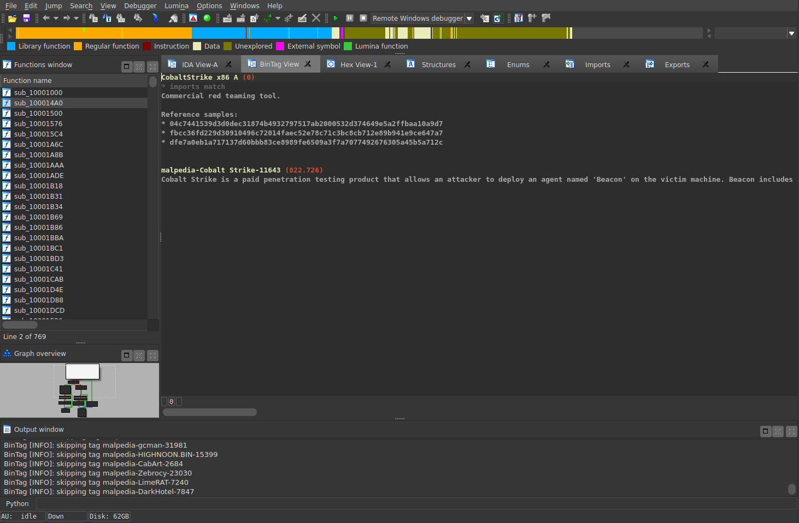

# BinTag IDA Pro Plugin

BinTag allows you to check a loaded sample against a database of tags.
The plugin provides you with a list of tags created from similar binaries.

New BinTags can be created by choosing *Edit -> Add BinTag*.

## Screenshot

## BinTag Files

BinTag definition files are stored in `$HOME/.bintag/tags` on Linux systems.
Tags are stored in JSON format and contain a list of imported functions and mnemonic histograms as well as some meta information like an optional description string and flags indicating whether the tag should be applied on 32bit or 64bit binaries.

## Similarity Analysis

The similarity between the mnemonic histogram vectors of the loaded sample and the BinTag definitions is computed as angular similarity * euclidean distance.

Imports are currently not part of the analysis, however if a sample has the same imports as specified in the BinTag definition a notification is displayed in the BinTag View.

## Performance

The similarity computation has a complexity of O(n²) and thus can be quite demanding when large binaries are analyzed.

To reduce computation tags are skipped if the function count differs greatly between the BinTag definition and the loaded sample.

## Requirements

Currently only Linux is supported.
GCC with C++ 17 support is required.

## Installation

Clone this repository to `idasdk/plugins/bintag`.
To compile the plugin run `make NDEBUG=1` and `make __EA64__=1 NDEBUG=1`.
After compilation the plugin files are stored in `idasdk/bin/plugins`.

## License

BinTag is licensed under MIT License.
